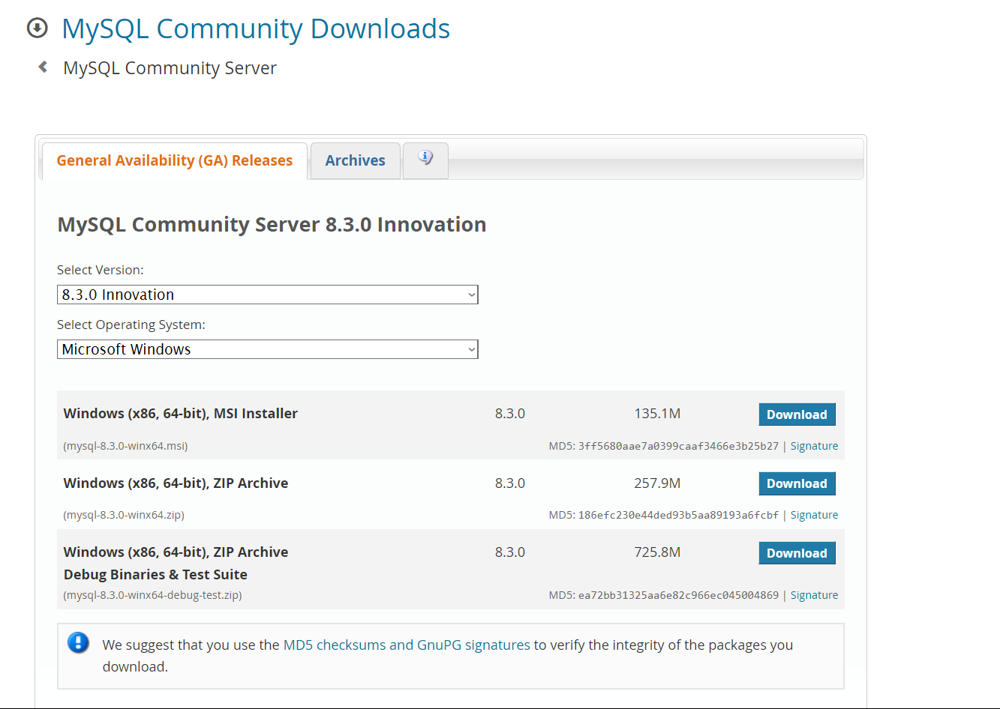
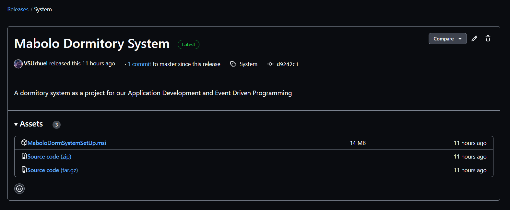
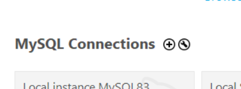
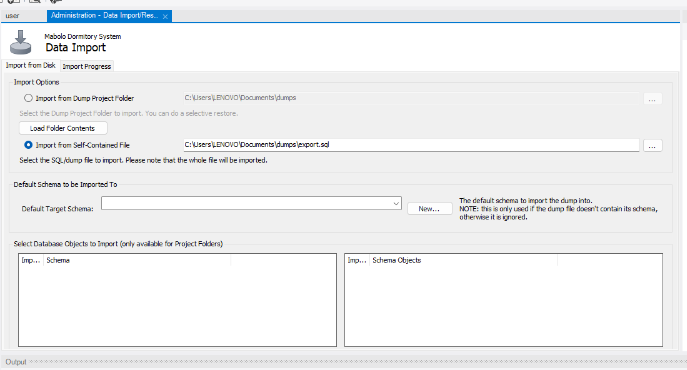
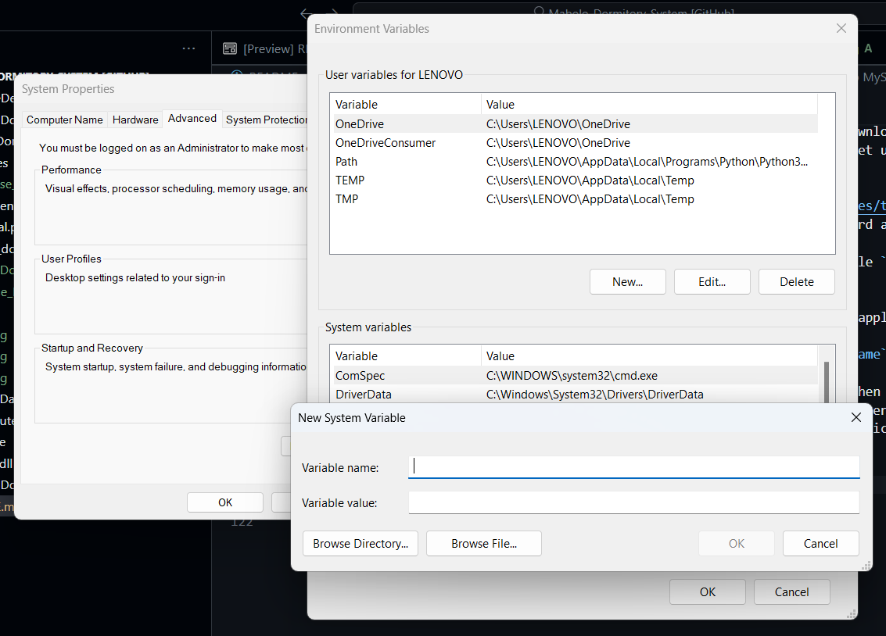
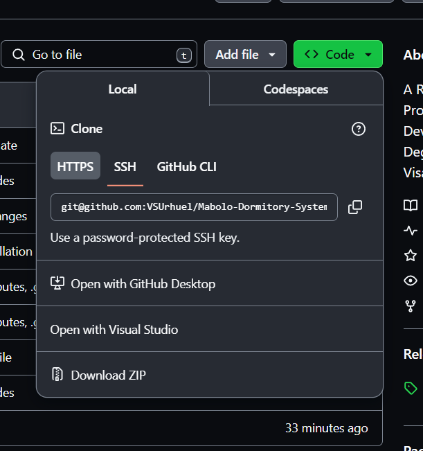

# **Save and Savor**

## **Introduction**
**Save and Savor** is a personal food inventory system designed to help users efficiently manage their food supplies while minimizing waste. With features that allow users to add, update, and remove food items, the system also sends timely notifications for items nearing expiration, ensuring that food is consumed before it spoils.

Developed as part of a hackathon competition at **Visayas State University**, Save and Savor aligns with **Sustainable Development Goal 2 (Zero Hunger)** by promoting food sustainability and reducing waste. By providing a clear overview of available food items, the system empowers users to make informed decisions, ultimately contributing to a more sustainable and waste-free lifestyle.

## **📑 Table of Contents**  

- [Features](#features)  
  - [Inventory Management](#-inventory-management)  
  - [Expiration Tracking](#-expiration-tracking)  
  - [Comprehensive Overview](#-comprehensive-overview)  
  - [Export Inventory as PDF](#-export-inventory-as-pdf)  
  - [User-Friendly Interface](#-user-friendly-interface)  
  - [Food Waste Reduction](#-food-waste-reduction)  
- [Installation](#installation)  
  - [Prerequisites](#prerequisites)  
  - [Steps to Install](#steps-to-install)  
- [Usage](#-usage)  
- [Configuration](#configuration)  
- [Technologies Used](#-technologies-used)  
- [Developer Credits](#-developer-credits)  
- [Contributing](#-contributing)  
- [Contact](#-contact)  

---

## **Features**  

### **📦 Inventory Management**  
The system offers a structured and efficient approach to managing food inventory. Users can seamlessly add, update, and delete food items while maintaining accurate records of quantity, storage location, and expiration dates. This ensures an organized and accessible inventory.  

### **⏳ Expiration Tracking**  
To prevent food spoilage, the system automatically tracks expiration dates and categorizes food items as **Fresh**, **Expiring Soon**, or **Expired**. Users receive timely notifications when items are nearing expiration, allowing them to make informed consumption decisions and reduce waste.  

### **📊 Comprehensive Overview**  
A well-structured overview of the inventory provides users with clear insights into their food stock. Items are categorized by **food type** and **storage location**, including refrigerators, freezers, pantries, and other designated areas, facilitating easy access and efficient inventory management.  

### **📄 Export Inventory as PDF**  
Users can export their inventory data as a PDF file, allowing for easy record-keeping, sharing, or printing. This feature ensures flexibility in managing and reviewing food stock outside the application, with a clean and professional format suitable for documentation. 

### **🖥️ User-Friendly Interface**  
Designed for ease of use, the system features an intuitive and user-friendly interface. Whether adding new food items, updating existing ones, or monitoring expiration statuses, users can navigate the system effortlessly. The logical data structure ensures a seamless and efficient user experience.  

### **♻️ Food Waste Reduction**  
By actively tracking expiration dates and providing automated alerts, the system promotes responsible food consumption. This feature encourages users to utilize perishable items before expiration, leading to better meal planning, financial savings, and a more sustainable lifestyle.  

## **Installation**
### **Prerequisites**
#### MySql Server

- You should have a **MySql community server**. If you don't have it, you can download it from the [official website](https://dev.mysql.com/downloads/mysql/). Follow the setup process and install it.

#### Download Resources

- Visit [this link](https://github.com/VSUrhuel/Mabolo-Dormitory-System/releases) to download the latest release version of this app. Click the **latest** `.msi` file to download it. 


- Navigate to the `Resources` folder in this repository and download the SQL file `SystemDatabase`.

### Set Up MySql

- Open the MySql Workbench application. Click the plus icon next to the application's text logo.


- Enter the connection name and note the `hostname` and `username`.


- Click the database you created. Go to the `server` section, click `Data Import`, select `Import from Self-Contained file`, then choose the directory where the downloaded `SystemDatabase` is located. Finally, click `Start Import`.

- Congratulations! You have finished setting up MySql! Scroll down for more!
### Set Up Environment Variables

- In Windows search, look for `environment variables` settings. In `system variables`, click `add`.

- Add these three `variable names` individually: `MYSQL_PASSWORD`, `MYSQL_SERVER`, `MYSQL_USERNAME` (follow these names strictly), and set their values to the corresponding values you entered when setting up your database.

  ### Install
- Run the installation process downloaded from [this GitHub link](https://github.com/VSUrhuel/Mabolo-Dormitory-System/releases/tag/System). **You can now use the app!**

## How to Open Using Visual Studio?

- Click `code` at the top and select `Open with Visual Studio`.

- To fully utilize this, download various NutGet extensions, including but not limited to `MySql`, `Xunit`, and `MySql Connector`. These can be easily downloaded in NutGet Packages.

- For `GunaUI`, **DO NOT** download it from NutGet package. Manually download the `dll` file and add it to the project's references. You can download the `GunaUI.dll` from this repository.

### **Steps to Install**
1. **Clone the repository**:
   ```bash
   git clone <repository-url>
   cd <project-directory>
   ```  
2. **Install dependencies**:
   ```bash
   [installation command, e.g., npm install or pip install -r requirements.txt]
   ```  
3. **Run the application**:
   ```bash
   [command to start the app]
   ```  

## 📌 **Usage**  

Follow these steps to effectively manage your food inventory and reduce waste:  

### 1️⃣ Open the Application  
Launch the application and navigate to the **inventory dashboard**, where you can view a comprehensive list of all stored food items categorized by **food type** and **storage location** (e.g., fridge, freezer, pantry).  

### 2️⃣ Manage Your Inventory  
Easily **add new food items** by providing key details such as:  
   - **Item name** (e.g., "Milk," "Apples," "Chicken Breast")  
   - **Quantity** (e.g., "2 liters," "5 pieces," "1 kg")  
   - **Category** (e.g., Dairy, Fruits, Vegetables, Meat & Poultry)  
   - **Storage location** (where the item is stored)  
   - **Expiration date** (to enable tracking)  

Once entered, the item will be stored in the database and displayed in your inventory dashboard.  

### 3️⃣ Edit or Delete Items  
Modify existing food items when necessary:  
   - **Edit items** if you consume part of an item, change storage location, or update any details.  
   - **Delete items** once they are fully consumed or discarded to keep your inventory up to date.  

### 4️⃣ Enter Your Email Address  
To receive timely expiration notifications, provide a **valid email address** in the application settings. This ensures that you stay informed about items that are approaching expiration.  

### 5️⃣ Get Notified and Take Action  
The system automatically tracks expiration dates and sends **reminders** when items are **Expiring Soon** or have already **Expired**. Upon receiving a notification:  
   - **Prioritize consuming items that are nearing expiration** to minimize waste.  
   - **Plan meals accordingly** to make the best use of perishable food.  
   - **Dispose of expired items safely** to maintain food safety.  

## **Configuration**
- [Mention any environment variables or settings that need configuration]

## 🚀 **Technologies Used**  

- **🖥️ C#** – Used for backend development, handling business logic, data processing, and system functionalities.  
- **🎨 Guna UI** – A powerful UI framework that enhances the visual appeal and user experience with modern and responsive interface components.  
- **🗄️ MySQL** – A robust relational database management system (RDBMS) used for storing, managing, and retrieving food inventory data efficiently.  
- **🔄 GitHub** – Enables version control, code collaboration, and project management, ensuring seamless teamwork and continuous development.  

## 👨‍💻 **Developer Credits**  

### 👥 **Developers**  
- **John Rhuel C. Laurente**  
- **Jamir Oasis M. Andrade**  
- **Yñigo Niño C. Ramas**  
- **Norman John N. Bandibas**  

## 🤝 **Contributing**

Thank you for considering contributing to this project! Your support and contributions are greatly valued. Here are some ways you can contribute:  

1. **🐞 Report Bugs** – If you encounter any bugs or issues, please open an issue on GitHub to help improve the system.  
2. **💡 Suggest Features** – Have an idea for a new feature? Open an issue and share your suggestions to enhance the project.  
3. **🔀 Submit Pull Requests** – Fork the repository, implement your changes, and submit a pull request for review. Contributions to code optimization, UI improvements, and bug fixes are always welcome!  
4. **💬 Provide Feedback** – Share your insights, feedback, and ideas in the project's issues section to help refine the system.  
5. **📢 Spread the Word** – Help others discover this project by sharing it on social media or with your peers.  

We appreciate your interest and support! 🚀 Feel free to contribute by submitting a pull request or reporting issues.  

## 📩 **Contact**
📧 **saveandsavor.contact@gmail.com**
